# Vinago+ - AI Travel Companion

Version: 1.0  
Audience: Founders, product, UX/UI, engineering, content, operations  
Platforms: iOS, Android, Web  
Primary markets: Vietnam inbound travel, expat living, business travel, digital nomad support  

## Executive Summary

Vinago+ is a multilingual AI travel companion that helps foreigners discover, understand, and navigate Vietnam with practical context. It combines curated local content, maps, translation, phrase support, emergency help, and AI guidance across mobile and web.

The product should feel like a local guide, translator, map assistant, culture explainer, and itinerary planner in one trusted experience.

**Vinago+ is a multilingual-first AI platform. Every feature, content object, search result, map recommendation, notification, AI response, CMS workflow, analytics dashboard, and SEO page must be localized and searchable in the user's preferred language.**

### Core Product Promise

Foreign visitors can ask, point a camera, search nearby, or browse curated guides and receive clear, culturally aware answers in their own language.

### Supported Languages

| Tier | Code | Language | Content Coverage Target |
|---|---|---|---|
| Tier 1 | en | English | 100% |
| Tier 1 | vi | Vietnamese | 100% |
| Tier 1 | ko | Korean | 100% |
| Tier 1 | ja | Japanese | 100% |
| Tier 1 | zh | Chinese Simplified | 100% |
| Tier 2 | fr | French | 70% at launch, then 100% |
| Tier 2 | de | German | 70% |
| Tier 2 | es | Spanish | 70% |
| Tier 2 | ru | Russian | 70% |
| Tier 2 | th | Thai | 70% |

Default language: English. Vietnamese is source/content-critical, but it is not the default experience for international users.

---

# 0. Multilingual-First Requirements

## Principle

Multilingual support is not a presentation layer. It is a core platform capability across product, data, search, AI, maps, CMS, analytics, notifications, and SEO.

## System Requirements

| Area | Requirement |
|---|---|
| UI | Every label, CTA, empty state, error state, form message, subscription copy, notification preference, and admin label must be translatable. |
| Content | Every content entity must support canonical data plus per-locale translations, slugs, SEO metadata, and AI context. |
| AI | AI must respond in the user's selected language by default, without requiring the user to ask for translation. |
| Search | Users can search in any supported language and find the canonical entity. |
| Maps | Map recommendations, route explanations, category labels, and relevance reasons must be localized. |
| CMS | Editors create source content, generate AI translations, human-review per locale, then publish per locale. |
| Web SEO | Each locale has indexable URLs, localized metadata, hreflang, canonical rules, and localized structured data. |
| Notifications | Push, email, and marketing campaigns must render in the user's preferred language with fallback. |
| Analytics | Product and business metrics must be segmented by locale and language tier. |

## UI Localization

### Locale File Structure

```txt
apps/mobile/src/locales/
  en.json
  vi.json
  ko.json
  ja.json
  zh.json
  fr.json
  de.json
  es.json
  ru.json
  th.json

apps/web/messages/
  en.json
  vi.json
  ko.json
  ja.json
  zh.json
  fr.json
  de.json
  es.json
  ru.json
  th.json
```

### UI Key Naming

```json
{
  "nav.home": "Home",
  "nav.explore": "Explore",
  "nav.nearby": "Nearby",
  "nav.food": "Food",
  "nav.culture": "Culture",
  "nav.translate": "Translate",
  "nav.favorites": "Favorites",
  "nav.settings": "Settings",
  "error.offline": "You are offline. Showing saved content.",
  "empty.search": "Try searching for a city, food, place, or phrase."
}
```

Rules:

- No hardcoded user-facing text in mobile, web, admin, email, push, or server-generated responses.
- Locale keys must be reviewed during PR.
- Missing locale keys fail CI for Tier 1 languages.
- Tier 2 missing keys fall back to English and create translation backlog items.

## Language Detection And Switching

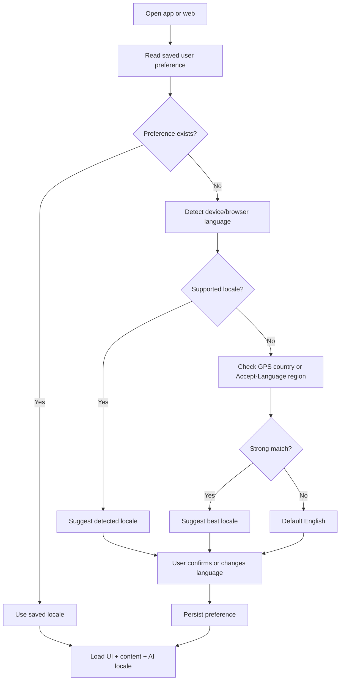

Detection priority:

1. Explicit user preference.
2. Auth profile preference.
3. Device language on mobile.
4. Browser `Accept-Language` on web.
5. GPS country/region as a weak suggestion, never an override.
6. English fallback.

## Content Localization

All canonical entities use stable IDs. Translations are separate rows keyed by `entity_id + locale`.

Canonical example:

```json
{
  "place_id": "ben_thanh_market",
  "lat": 10.772,
  "lng": 106.698,
  "category": "market",
  "city_id": "ho_chi_minh_city"
}
```

Localized names:

```json
{
  "en": "Ben Thanh Market",
  "vi": "Chợ Bến Thành",
  "ko": "벤탄 시장",
  "ja": "ベンタイン市場",
  "zh": "滨城市场",
  "fr": "Marché Ben Thanh"
}
```

Fallback order:

```txt
requested locale
→ same language script variant if available
→ English
→ Vietnamese source
→ canonical ID with unavailable-content state
```

## AI Localization

AI response language is determined by:

1. User selected language.
2. Conversation override only if user explicitly asks.
3. Detected input language as a hint, not the default.

Example:

```txt
User profile language: Korean
Location: Ben Thanh Market
Question: What is this place?
AI response: 벤탄 시장은 호치민시 중심부에 있는 대표적인 전통 시장입니다...
```

AI must localize:

- answer language
- suggested follow-up questions
- route explanations
- warnings
- phrase suggestions
- source labels
- upgrade/limit messages

## AI Translation Layer

| Mode | Input | Output | UX |
|---|---|---|---|
| Text Translation | typed/pasted text | translated text, pronunciation, copy/play actions | split input/output panel |
| Voice Translation | speech | transcript + translation + TTS | hold-to-talk or tap-to-record |
| Image Translation | sign/menu/photo | OCR text + translated overlay/list | camera capture result sheet |
| Conversation Translation | two speakers | alternating transcript and audio | split-screen conversation mode |
| Real-Time Translation | continuous audio | streaming translated captions/audio | premium/live mode |

### Translation Architecture

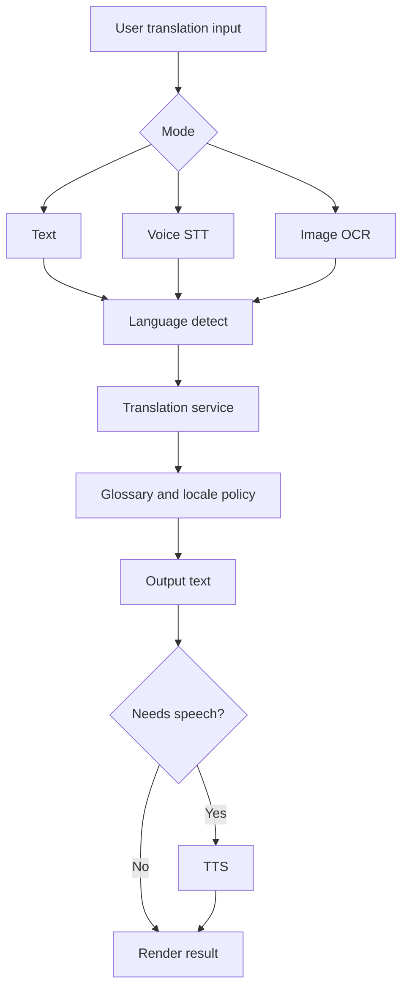

## CMS Translation Workflow

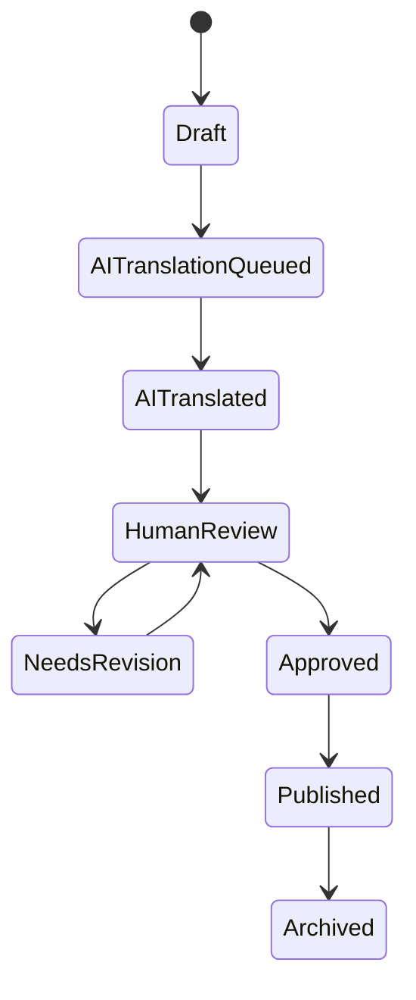

Per-locale statuses:

| Status | Meaning |
|---|---|
| `missing` | No translation exists |
| `machine_translated` | AI generated, not reviewed |
| `in_review` | Human reviewer assigned |
| `needs_revision` | Reviewer requested edits |
| `approved` | Ready to publish |
| `published` | Visible in app/web/search/SEO |

## Multilingual Search

Users must be able to search by native names, translated names, aliases, romanization, local spelling, and common misspellings.

Examples:

| Query | Locale/Input | Result |
|---|---|---|
| `ベンタイン市場` | Japanese | Ben Thanh Market |
| `Chợ Bến Thành` | Vietnamese | Ben Thanh Market |
| `滨城市场` | Chinese Simplified | Ben Thanh Market |
| `벤탄 시장` | Korean | Ben Thanh Market |
| `Marche Ben Thanh` | French without accent | Ben Thanh Market |

### Search Architecture

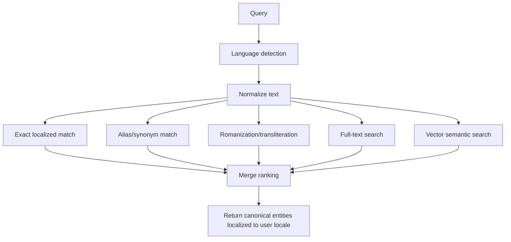

Recommended index strategy:

- OpenSearch/Elasticsearch index per entity type.
- Fields per locale: `name.en`, `name.ko`, `name.ja`, `name.zh`, `description.en`, etc.
- Analyzer per language: Korean, Japanese, CJK, French/German/Spanish, Vietnamese accent folding.
- Alias fields: local names, romanized names, common misspellings, historical names.
- Synonym dictionaries per locale and travel domain.
- Store canonical entity ID so all language queries resolve to the same object.

## Multilingual SEO

Requirements:

- Locale-prefixed routes: `/en`, `/vi`, `/ko`, `/ja`, `/zh`, `/fr`, then Tier 2.
- `hreflang` alternates for every translated page.
- One canonical URL per locale page.
- Localized slugs where beneficial, while maintaining canonical entity mapping.
- Localized `title`, `description`, Open Graph, Twitter cards, and Schema.org.
- Multilingual XML sitemaps segmented by locale and entity type.

## Multilingual Notifications

Notifications must use template keys and localized payload rendering.

```json
{
  "template_key": "nearby.hidden_gems",
  "locale": "ja",
  "variables": {
    "city": "Da Nang",
    "place_name": "My Khe Beach"
  }
}
```

Fallback:

```txt
user locale template
→ English template
→ do not send if message is safety/legal/medical and translation missing
```

Channels:

- mobile push
- email
- in-app messages
- marketing campaigns
- subscription/payment messages
- emergency/safety alerts

## Analytics By Language

Dashboard dimensions:

- selected language
- detected language
- country/region
- platform
- content language served
- fallback language used
- AI response language
- search query language

Core dashboards:

| Dashboard | Metrics |
|---|---|
| Users by language | DAU/MAU, signups, guest users, country split |
| Retention by language | D1/D7/D30, return sessions, saved items |
| Revenue by language | premium conversion, ARPU, affiliate CTR, sponsored listing performance |
| Content by language | coverage, missing translations, review backlog, stale translations |
| Search by language | zero-result rate, top queries, cross-language matches |
| AI by language | messages, satisfaction, fallback rate, cost, hallucination reports |
| Destinations by language | top cities, places, foods, routes by locale |

## Multilingual Definition Of Done

- Tier 1 UI coverage is 100% before release.
- Tier 1 core content coverage is 100% for launch cities.
- Every AI response has `response_locale`.
- Every search event has `query_language` and `result_locale`.
- Every SEO page has hreflang and localized metadata.
- Every notification template has Tier 1 variants.
- Admin dashboard exposes translation completeness per locale.

---

# 1. Product Requirements Document

## Vision

Become the most trusted AI-powered Vietnam companion for international visitors, long-stay foreigners, and global travelers planning or experiencing Vietnam.

## Mission

Help foreigners understand Vietnam beyond navigation: what a place means, what food contains, how to behave respectfully, what to say in Vietnamese, and where to go next based on context.

## Goals

| Goal | Metric |
|---|---|
| Help users find relevant places quickly | Search-to-detail conversion, map engagement |
| Reduce travel uncertainty | AI chat satisfaction, saved emergency phrase usage |
| Improve multilingual discovery | Indexed multilingual pages, locale retention |
| Monetize high-intent travel moments | Premium conversion, affiliate CTR, sponsored listing ROI |
| Build trusted content operations | Published content quality score, translation approval SLA |

## Non-Goals For MVP

- Fully automated travel booking.
- Real-time ride hailing.
- User-generated social network.
- Complex tour operator marketplace.
- Native offline vector maps.

## User Personas

| Persona | Needs | Pain Points | Product Value |
|---|---|---|---|
| First-time Tourist | Places, food, safety, routes | Language barriers, scams, unclear pricing | AI guide, translation, nearby, culture tips |
| Foreigner Living in Vietnam | Daily phrases, services, local habits | Admin tasks, local norms, medical needs | Phrasebook, culture, emergency, saved content |
| Business Traveler | Efficient plans, transport, restaurants | Limited time, unknown city areas | AI itinerary, nearby, premium planning |
| Digital Nomad | Cafes, SIM/eSIM, coworking, neighborhoods | Discovery fatigue, mixed-quality info | map filters, hidden gems, local guides |
| International Student | Budget food, transport, language learning | Low confidence speaking Vietnamese | phrases, food guide, culture guide |

## User Stories

| ID | User Story | Priority |
|---|---|---|
| US-01 | As a tourist, I want to select my language so all UI and content are understandable. | P0 |
| US-02 | As a user, I want to browse places by city/category so I can plan quickly. | P0 |
| US-03 | As a user, I want a place detail page with history, hours, price, safety, and route actions. | P0 |
| US-04 | As a user, I want to ask AI travel questions in my language. | P0 |
| US-05 | As a user, I want food information with ingredients and allergens. | P0 |
| US-06 | As a user, I want common Vietnamese phrases for taxis, restaurants, hotels, shopping, and emergencies. | P0 |
| US-07 | As a user, I want nearby attractions, cafes, hospitals, ATMs, and police. | P1 |
| US-08 | As a user, I want to point my camera at a food/menu/sign/place and understand it. | P1 |
| US-09 | As an admin, I want to create Vietnamese/English content and AI-translate it for review. | P0 |
| US-10 | As a web visitor, I want localized SEO pages by language. | P0 |
| US-11 | As a premium user, I want offline city packs and unlimited AI. | P2 |
| US-12 | As a Korean tourist standing at a landmark, I want AI to answer in Korean automatically. | P0 |
| US-13 | As a Japanese web user, I want to search Japanese names and still find the correct Vietnam place. | P0 |
| US-14 | As a content reviewer, I want to approve translations per locale before they publish. | P0 |
| US-15 | As a growth manager, I want retention and revenue metrics by language. | P1 |

## Feature List

### MVP Features

| Area | Features |
|---|---|
| Multilingual Core | UI locale, content locale, AI response locale, multilingual search, language switcher, fallback to English |
| Onboarding | language, purpose, city, trip length |
| Home | search, AI ask box, nearby suggestions, today tips |
| Explore | city list, place list, filters, place detail, map CTA |
| Food | food guide, allergens, spice level, ordering phrases |
| Culture | etiquette, customs, traffic, bargaining, temple rules |
| Phrasebook | categories, favorites, offline-ready phrases |
| AI Chat | travel Q&A, local expert, itinerary starter, translation starter |
| Favorites | saved places, foods, phrases, topics |
| Web SEO | localized routes and metadata |
| Admin | content CRUD, translation workflow, approval by locale, translation coverage dashboard |
| Notifications | localized push/email/in-app templates for Tier 1 |

### Post-MVP Features

| Area | Features |
|---|---|
| AI Camera | place recognition, food recognition, OCR, menu translation |
| Voice | speech-to-speech translation, voice assistant |
| Nearby | live location, route planning, category filters |
| Premium | offline packs, unlimited AI, advanced itineraries |
| Reviews | user reviews, ratings, content reports |
| Affiliates | tours, hotels, eSIM, local experiences |

## User Journey

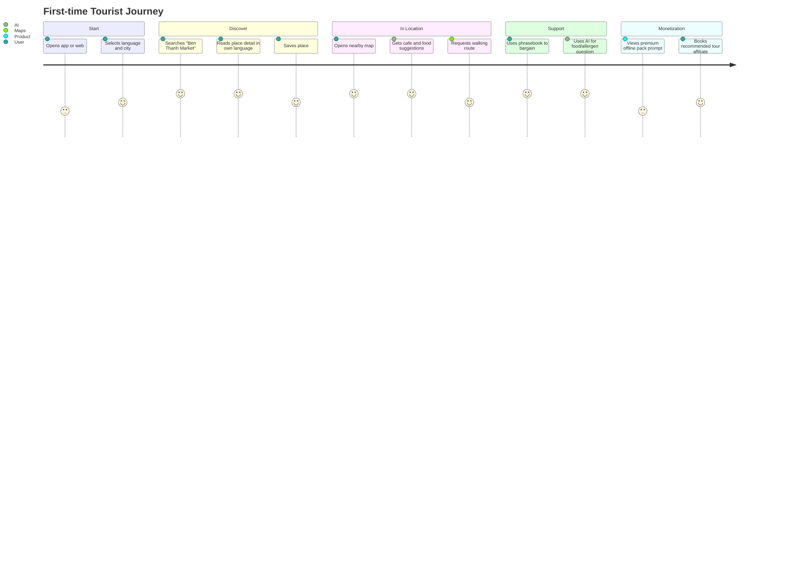

## Monetization

| Channel | Free | Premium/Revenue |
|---|---|---|
| AI Chat | 20 messages/day | Unlimited, higher context |
| AI Camera | Limited preview | Full recognition and OCR |
| Translation | Basic text | Voice and conversation mode |
| Offline | Saved items only | City packs |
| Itinerary | Basic plan | Advanced multi-day route optimization |
| Affiliates | Visible to all | Commission from tours, hotels, eSIM |
| Sponsored Listings | Disclosed placements | CPC/CPA/local merchants |

---

# 2. Information Architecture

## Sitemap

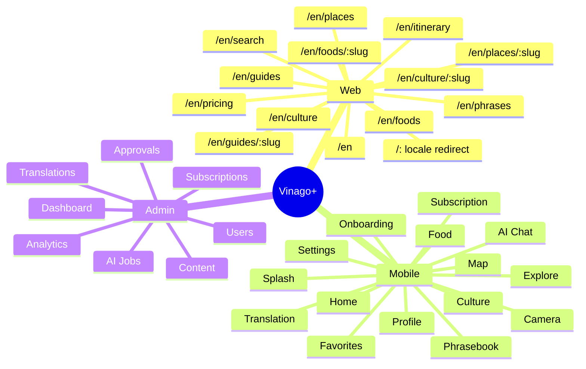

## Navigation Structure

### Mobile Primary Tabs

| Tab | Purpose |
|---|---|
| Home | Personalized entry point |
| Explore | Places and map |
| Food | Food guide |
| AI | AI chat/camera/itinerary |
| Saved | Favorites/offline |

Secondary menu: Culture, Phrasebook, Translation, Nearby, Profile, Settings, Subscription.

### Web Navigation

Top nav:

1. Explore
2. Food
3. Culture
4. Phrasebook
5. AI Trip Planner
6. Pricing
7. Language selector
8. Sign in

Footer:

Cities, places, foods, culture guides, emergency info, affiliate disclosure, terms, privacy.

## Menu Hierarchy

```txt
Home
Explore
  Cities
  Places
  Map
  Nearby
Food
  Food by Region
  Food Detail
  Allergen Guide
Culture
  Etiquette
  Holidays
  History
  Local Habits
AI
  Chat
  Camera
  Itinerary
  Translation
Saved
  Places
  Foods
  Phrases
  Itineraries
Profile
  Account
  Language
  Subscription
  Offline Packs
  Settings
```

## Core User Flows

### Language Detection

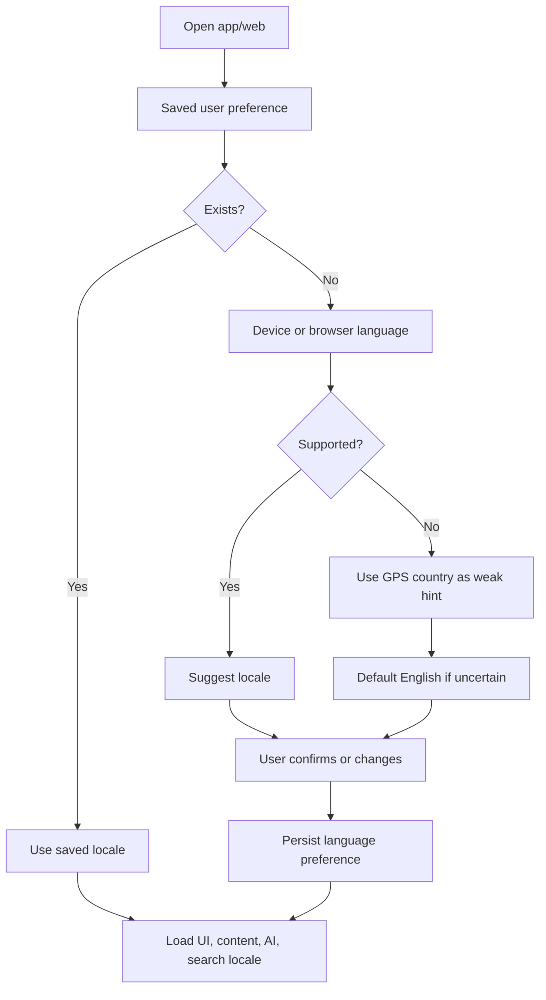

### Place Discovery

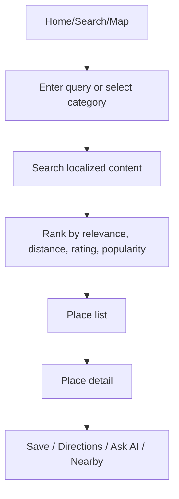

### Admin Translation Flow

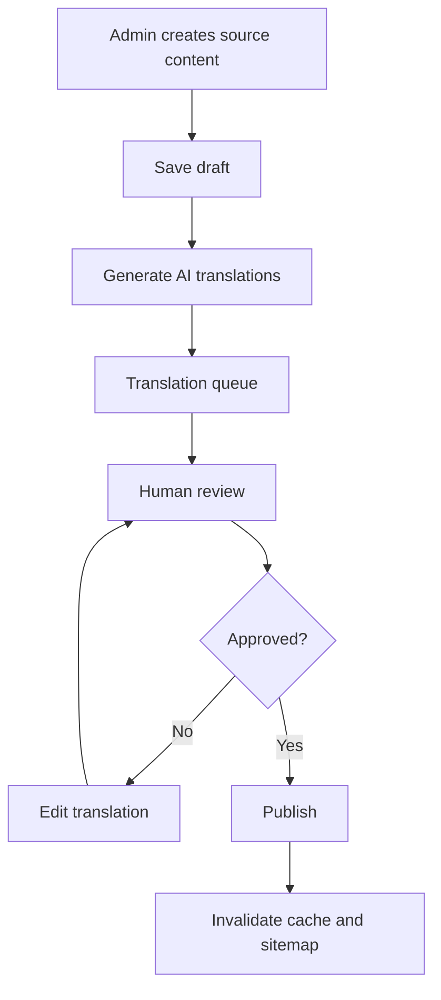

---

# 3. UX Design

## Global UX Principles

- Clear, calm, information-dense travel utility.
- Never make users guess whether data is AI-generated, editorial, sponsored, or user-generated.
- Always show practical next actions: save, route, translate, ask, share.
- Language switch should be visible but not intrusive.
- Emergency access should be one tap from Profile/Home/Translation.
- Avoid marketing-style landing behavior inside the app. The first screen after onboarding is the usable product.

## Global Components

| Component | Notes |
|---|---|
| Locale selector | Bottom sheet on mobile, dropdown on web |
| Search bar | Global, supports text and voice later |
| Place card | image, name, city, category, distance, rating |
| AI ask box | quick prompts plus free text |
| Save button | consistent heart icon |
| Route CTA | opens internal map, then external maps fallback |
| Translation CTA | appears on phrase, food, place, menu contexts |
| Safety badge | for emergency and late-night warnings |
| Sponsored badge | required for paid placements |

## Screen Specifications

### 3.1 Splash

| Item | Specification |
|---|---|
| Purpose | Initialize app, locale, auth state, cache, remote config |
| Layout | Center logo, app name, loading indicator |
| Components | Logo, progress state, optional offline banner |
| Actions | Auto-route to onboarding/home |
| States | loading, offline cached, maintenance |
| Empty | None |
| Error | Retry, continue offline |

Wireframe:

```txt
+--------------------------+
|                          |
|          [Logo]          |
|   Vinago+                 |
|   AI Travel Companion    |
|                          |
|        Loading...        |
+--------------------------+
```

### 3.2 Onboarding

| Item | Specification |
|---|---|
| Purpose | Capture language, goal, city, travel style |
| Layout | Multi-step cards or paged flow |
| Components | language chips, purpose chips, city selector, trip days |
| Actions | select, skip, continue, enable location |
| States | first run, returning user, permission pending |
| Empty | If city unavailable, show "Other" |
| Error | Location permission denied, fallback city select |

### 3.3 Home

| Item | Specification |
|---|---|
| Purpose | Personalized command center |
| Layout | Search, AI ask, nearby, today, popular places, food, culture |
| Components | search bar, AI prompt cards, map teaser, content rails |
| Actions | search, ask AI, open map, save, change city |
| States | GPS on, GPS off, guest, premium |
| Empty | Ask user to select city |
| Error | API unavailable, show cached content |

### 3.4 Search

| Item | Specification |
|---|---|
| Purpose | Search across places, food, culture, phrases, guides |
| Layout | Search input, filters, result tabs |
| Components | query input, filters, recent searches, result cards |
| Actions | submit, filter, open detail, ask AI |
| States | typing, loading, results, no results |
| Empty | Suggested searches |
| Error | Retry, offline search subset |

### 3.5 Explore Vietnam

| Item | Specification |
|---|---|
| Purpose | Browse Vietnam by city/category/map |
| Layout | City chips, category filters, list/map toggle |
| Components | city selector, place cards, map mini-view |
| Actions | filter, switch map, save, route |
| States | list, map, nearby, offline city pack |
| Empty | No matching places |
| Error | Map provider unavailable |

### 3.6 Place Detail

| Item | Specification |
|---|---|
| Purpose | Guide-style explanation of a place |
| Layout | hero image, name, badges, detail sections, actions |
| Components | gallery, facts, history, best time, cost, route, nearby, AI questions |
| Actions | save, directions, ask AI, translate, share, report |
| States | open now, closed now, crowded, sponsored nearby |
| Empty | Missing hours/price marked unknown |
| Error | Content unavailable, fallback summary |

### 3.7 Food Guide

| Item | Specification |
|---|---|
| Purpose | Help users discover Vietnamese food safely |
| Layout | region/category filters, dish cards |
| Components | spice filter, allergen filter, region tabs |
| Actions | open dish, save, ask AI, show phrase |
| States | vegetarian, allergy profile, region selected |
| Empty | Suggested popular foods |
| Error | Offline basic food pack |

### 3.8 Food Detail

| Item | Specification |
|---|---|
| Purpose | Explain ingredients, taste, allergens, ordering |
| Layout | image, dish facts, ingredient/allergen cards, phrase |
| Components | spice level, price, how to order, pronunciation |
| Actions | save, translate, play audio, ask AI |
| States | allergy warning, vegetarian warning |
| Empty | Unknown price or ingredients |
| Error | AI answer falls back to curated data |

### 3.9 Culture Guide

| Item | Specification |
|---|---|
| Purpose | Explain etiquette and local behavior |
| Layout | topic grid and topic detail |
| Components | dos/don'ts, examples, AI explainer |
| Actions | save, ask AI, share |
| States | near temple, near Tet, traffic context |
| Empty | Featured topics |
| Error | Cached culture tips |

### 3.10 Phrasebook

| Item | Specification |
|---|---|
| Purpose | Practical Vietnamese phrases |
| Layout | category tabs, phrase cards |
| Components | Vietnamese text, pronunciation, audio, favorite |
| Actions | play audio, save, copy, enlarge text |
| States | offline, audio unavailable |
| Empty | Popular phrase categories |
| Error | Text-only fallback |

### 3.11 AI Chat

| Item | Specification |
|---|---|
| Purpose | Natural-language travel assistant |
| Layout | chat thread, context chips, input bar |
| Components | text input, voice button, image attach, location chip |
| Actions | send, attach photo, use location, save answer |
| States | streaming, tool call, limit reached, guest mode |
| Empty | Prompt starters |
| Error | Retry, answer from local data, upgrade prompt |

### 3.12 AI Camera

| Item | Specification |
|---|---|
| Purpose | Recognize places, food, signs, menus |
| Layout | camera view, capture button, result sheet |
| Components | camera, gallery picker, OCR result, translation result |
| Actions | capture, retake, translate, ask follow-up |
| States | permission denied, analyzing, recognized, uncertain |
| Empty | Camera permission prompt |
| Error | Could not recognize; suggest manual search |

### 3.13 Translation

| Item | Specification |
|---|---|
| Purpose | Text, voice, camera, conversation translation |
| Layout | mode tabs, input/output panels |
| Components | language pair selector, mic, camera, conversation split |
| Actions | type, speak, swap, play audio, copy |
| States | listening, translating, offline phrase fallback |
| Empty | Example phrases |
| Error | Translation failed, retry |

### 3.14 Nearby

| Item | Specification |
|---|---|
| Purpose | Find nearby useful locations |
| Layout | map + bottom sheet list |
| Components | category chips, radius selector, result cards |
| Actions | route, save, call, filter, ask AI |
| States | GPS allowed/denied, loading, selected marker |
| Empty | Select city manually |
| Error | Provider unavailable, cached popular places |

### 3.15 AI Itinerary

| Item | Specification |
|---|---|
| Purpose | Generate day-by-day plans |
| Layout | form, preference chips, result cards |
| Components | city, days, budget, pace, interests, mobility |
| Actions | generate, edit, save, route day, export |
| States | generating, editable, premium route optimization |
| Empty | Suggested itinerary templates |
| Error | Use template itinerary |

### 3.16 Favorites

| Item | Specification |
|---|---|
| Purpose | Save important content |
| Layout | tabs by type |
| Components | saved cards, offline badge, sort/filter |
| Actions | open, remove, download offline |
| States | synced, offline, guest local only |
| Empty | Explain benefits and suggest items |
| Error | Sync failed, keep local |

### 3.17 Profile

| Item | Specification |
|---|---|
| Purpose | Account, preferences, saved profile |
| Layout | profile header, plan, settings list |
| Components | avatar, login CTA, trip profile, allergy profile |
| Actions | sign in, edit profile, manage subscription |
| States | guest, authenticated, premium |
| Empty | Guest profile prompt |
| Error | Auth retry |

### 3.18 Settings

| Item | Specification |
|---|---|
| Purpose | Control locale, privacy, notifications, offline |
| Layout | grouped settings list |
| Components | language selector, units, map provider, privacy toggles |
| Actions | change language, clear cache, export/delete data |
| States | offline packs installed |
| Empty | None |
| Error | Save failed |

### 3.19 Subscription

| Item | Specification |
|---|---|
| Purpose | Explain and sell premium |
| Layout | comparison table, plan cards |
| Components | features, monthly/yearly toggle, restore purchase |
| Actions | subscribe, restore, enter coupon |
| States | trial, active, expired, failed payment |
| Empty | None |
| Error | Purchase failed/retry |

---

# 4. Map Experience

## Map Goals

- Turn location into useful local guidance.
- Support practical needs: attractions, food, coffee, hotels, hospitals, police, pharmacies, embassies, ATMs, public transport.
- Explain why each result is relevant.
- Allow AI to build routes, half-day plans, and hidden-gem walks.

## Map Categories

| Category | Icon | User Need |
|---|---|---|
| Attractions | landmark | Sightseeing |
| Restaurants | utensils | Food |
| Coffee Shops | coffee | Work/rest |
| Hotels | bed | Stay |
| Hospitals | cross | Emergency |
| Police Stations | shield | Safety |
| Pharmacies | pill | Medicine |
| Embassies | flag | Passport/legal help |
| ATMs | credit card | Cash |
| Public Transport | bus | Mobility |

## Map UX Flow

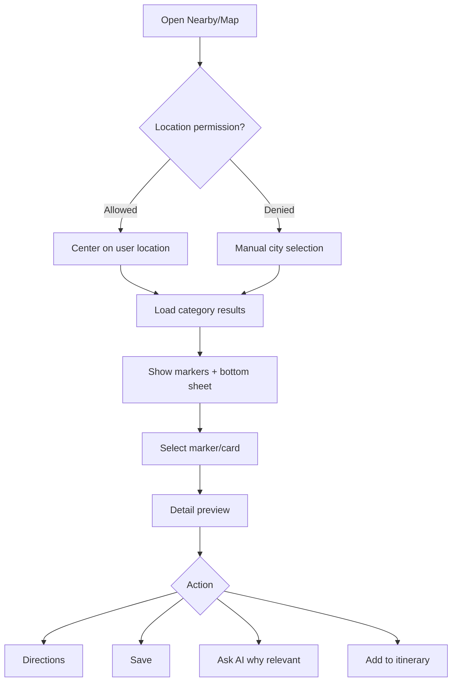

## Map Interaction Design

| Interaction | Behavior |
|---|---|
| Tap marker | Opens bottom sheet preview |
| Swipe bottom sheet | Collapsed, half, full |
| Category chip | Filters markers and list |
| Radius selector | 1 km, 3 km, 5 km |
| Route button | Shows walking/driving/public transport |
| AI route | Generates themed route with explanation |
| Heatmap toggle | Tourist hotspots, food density, hidden gems |
| Safety mode | Hospitals, police, embassies, pharmacies visible |

## AI Recommended Routes

Inputs:

- current location
- selected city
- time available
- walking tolerance
- interests
- opening hours
- weather/time of day
- user language
- premium status

Outputs:

- route title
- ordered stops
- walking/driving segments
- estimated time
- why this route
- safety notes
- food/cafe stops

---

# 5. AI Features

## AI Capability Matrix

| Capability | Inputs | Outputs | MVP |
|---|---|---|---|
| AI Travel Guide | text, city, locale | travel answer with citations to internal content | Yes |
| AI Local Expert | question, location, profile | practical local advice | Yes |
| AI Food Guide | food query, allergy profile | ingredients, spice, phrase | Yes |
| AI Culture Guide | topic/location | etiquette explanation | Yes |
| AI Storytelling | place/history | engaging story | P1 |
| AI Itinerary | city, days, interests, budget | day-by-day plan | Yes basic |
| AI Translation | text/voice/image | translated text/audio | P1 |
| AI Camera Recognition | image, OCR, GPS | object/place/menu explanation | P1 |
| AI Voice Assistant | speech, context | spoken guidance | P2 |
| AI Emergency Assistant | emergency type, location | instructions, numbers, phrases | P1 |

## AI Data Flow

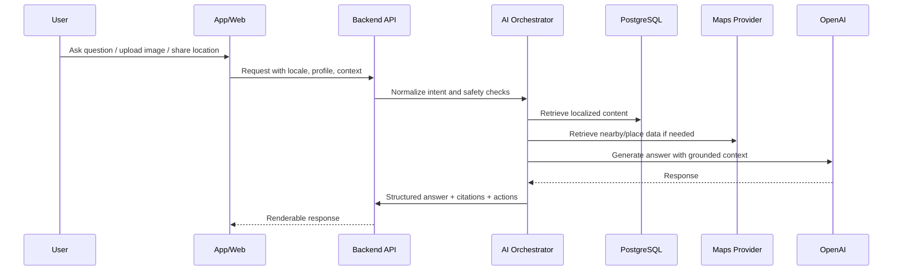

## Prompt Strategy

### System Principles

- Answer in user selected language.
- Prefer verified internal CMS/database content.
- Clearly say when data is unavailable or uncertain.
- Never invent opening hours, prices, emergency numbers, or safety claims.
- For medical/legal/emergency situations, provide immediate local emergency guidance and recommend contacting authorities/professionals.
- For sponsored/affiliate results, label them outside the AI answer or in metadata.

### Prompt Context Blocks

```json
{
  "locale": "ko",
  "user_profile": {
    "purpose": "Travel",
    "city": "Ho Chi Minh City",
    "allergies": ["peanuts"],
    "trip_days": 3
  },
  "intent": "food_question",
  "retrieved_content": [
    {
      "type": "food",
      "id": "banh_mi",
      "name": "Banh mi",
      "allergens": ["gluten", "pork", "fish sauce"]
    }
  ],
  "allowed_actions": ["save", "translate", "nearby", "directions"]
}
```

### Fallback Logic

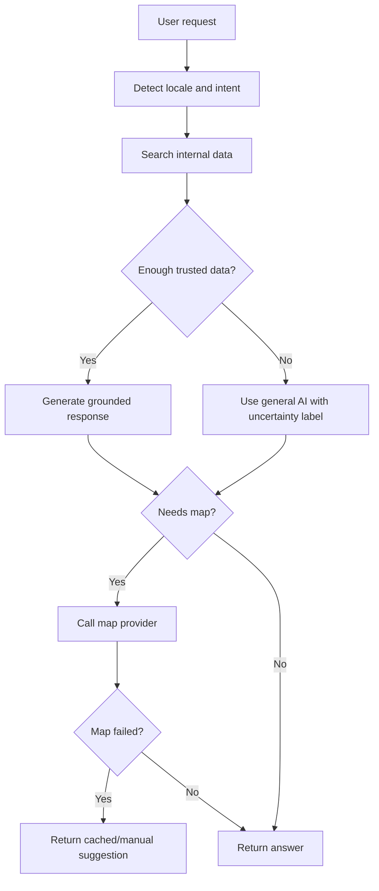

## AI Output Contract

```json
{
  "answer": "Ben Thanh Market is a central market...",
  "language": "en",
  "confidence": "high",
  "sources": [
    {
      "type": "place",
      "id": "ben_thanh_market",
      "field": "description"
    }
  ],
  "suggested_actions": [
    { "type": "directions", "label": "Get directions" },
    { "type": "nearby_food", "label": "Food nearby" }
  ],
  "warnings": []
}
```

---

# 6. Location Intelligence

## Example: User Standing At Ben Thanh Market

System behavior:

1. Detect current GPS coordinate.
2. Snap to known place if within geofence confidence threshold.
3. Retrieve place profile and localized content.
4. Find nearby attractions, restaurants, cafes, cultural sites.
5. Generate walking routes.
6. Generate half-day and full-day plans.
7. Explain relevance.

## Recommendation Algorithm

### Inputs

| Input | Source |
|---|---|
| User lat/lng | Device GPS |
| Locale | App setting |
| Purpose | User profile |
| Time available | User input or inferred |
| Current time/date | Device/backend |
| Place categories | CMS |
| Opening hours | CMS/Maps |
| Ratings/popularity | Internal + Maps |
| Distance/travel time | Maps API |
| Safety/emergency context | CMS + location |
| Sponsorship | Ads service with strict labeling |

### Scoring Formula

```txt
score =
  0.28 * relevance_to_interest +
  0.20 * proximity_score +
  0.16 * open_now_score +
  0.12 * popularity_score +
  0.10 * cultural_value_score +
  0.08 * route_fit_score +
  0.04 * freshness_score +
  0.02 * personalization_score

Final ranking rules:
- remove closed places unless explicitly relevant
- cap sponsored listings to configured slots
- diversify categories
- avoid unsafe late-night recommendations
- explain every top recommendation
```

### Relevance Explanation Template

```json
{
  "place_id": "saigon_opera_house",
  "reason": {
    "en": "It is a short walk from Ben Thanh Market and fits a first-time city-center route.",
    "ko": "벤탄 시장에서 걸어서 가까우며 처음 방문하는 여행자에게 좋은 도심 코스입니다."
  },
  "signals": ["distance_900m", "culture", "open_now", "popular_first_trip"]
}
```

### Half-Day Plan Example

```txt
Start: Ben Thanh Market
Stop 1: Independence Palace
Stop 2: Notre-Dame Cathedral area
Coffee: Nguyen Hue cafe apartment area
Food: Banh mi or pho nearby
End: Saigon Opera House / Nguyen Hue Walking Street
```

---

# 7. Content System

## Localization Model

Content entities use stable IDs plus translation tables. UI strings live in locale JSON. The canonical table never stores user-facing display copy except operational/source-safe identifiers. All public text must come from locale files or translation tables.

### UI Locale Files

```txt
locales/en.json
locales/vi.json
locales/ko.json
locales/ja.json
locales/zh.json
locales/fr.json
locales/de.json
locales/es.json
locales/ru.json
locales/th.json
```

### Content Translation Strategy

- Canonical record stores non-language operational data.
- Translation table stores localized title, slug, body fields, SEO fields, AI fields, aliases, and search keywords.
- Fallback order: requested locale -> same language variant -> English -> Vietnamese -> unavailable state.
- Translation status tracked per locale.
- Tier 1 languages block publishing for launch-city core content if incomplete.
- Tier 2 languages may publish with English fallback, but missing translations generate CMS tasks.

### Translation Workflow

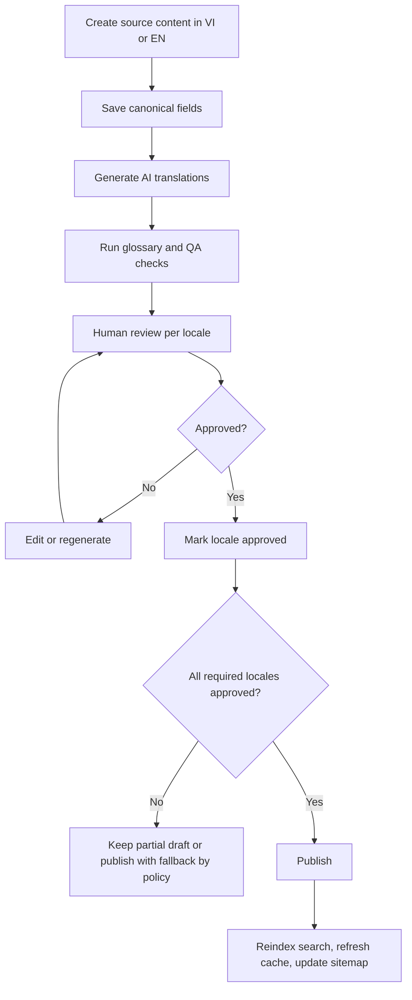

### Translation QA Fields

| Field | Purpose |
|---|---|
| `source_locale` | Original authoring language |
| `translated_by` | `ai`, `human`, or vendor |
| `reviewed_by` | Reviewer ID |
| `translation_status` | missing, machine_translated, in_review, approved, published |
| `translation_quality_score` | AI/human QA score |
| `glossary_warnings` | Term consistency issues |
| `last_reviewed_at` | Recency tracking |

## Entity Schemas

### Cities

```sql
CREATE TABLE cities (
  id UUID PRIMARY KEY,
  code TEXT UNIQUE NOT NULL,
  country_code TEXT DEFAULT 'VN',
  lat DOUBLE PRECISION,
  lng DOUBLE PRECISION,
  timezone TEXT DEFAULT 'Asia/Ho_Chi_Minh',
  is_published BOOLEAN DEFAULT FALSE,
  created_at TIMESTAMPTZ DEFAULT now(),
  updated_at TIMESTAMPTZ DEFAULT now()
);

CREATE TABLE city_translations (
  city_id UUID REFERENCES cities(id) ON DELETE CASCADE,
  locale TEXT NOT NULL,
  name TEXT NOT NULL,
  slug TEXT NOT NULL,
  aliases TEXT[],
  search_keywords TEXT[],
  summary TEXT,
  seo_title TEXT,
  seo_description TEXT,
  ai_summary TEXT,
  source_locale TEXT,
  translated_by TEXT,
  reviewed_by UUID,
  translation_quality_score NUMERIC,
  glossary_warnings JSONB,
  status TEXT DEFAULT 'draft',
  PRIMARY KEY (city_id, locale),
  UNIQUE (locale, slug)
);
```

### Places

```sql
CREATE TABLE places (
  id UUID PRIMARY KEY,
  city_id UUID REFERENCES cities(id),
  category TEXT NOT NULL,
  lat DOUBLE PRECISION NOT NULL,
  lng DOUBLE PRECISION NOT NULL,
  address TEXT,
  phone TEXT,
  website TEXT,
  ticket_price_min INTEGER,
  ticket_price_max INTEGER,
  currency TEXT DEFAULT 'VND',
  open_hours JSONB,
  tags TEXT[],
  safety_level TEXT,
  map_provider_place_id TEXT,
  is_sponsored BOOLEAN DEFAULT FALSE,
  is_published BOOLEAN DEFAULT FALSE,
  created_at TIMESTAMPTZ DEFAULT now(),
  updated_at TIMESTAMPTZ DEFAULT now()
);

CREATE TABLE place_translations (
  place_id UUID REFERENCES places(id) ON DELETE CASCADE,
  locale TEXT NOT NULL,
  name TEXT NOT NULL,
  slug TEXT NOT NULL,
  aliases TEXT[],
  romanized_name TEXT,
  search_keywords TEXT[],
  description TEXT,
  history TEXT,
  why_go TEXT,
  best_time TEXT,
  travel_tip TEXT,
  seo_title TEXT,
  seo_description TEXT,
  ai_context TEXT,
  source_locale TEXT,
  translated_by TEXT,
  reviewed_by UUID,
  translation_quality_score NUMERIC,
  glossary_warnings JSONB,
  status TEXT DEFAULT 'draft',
  PRIMARY KEY (place_id, locale),
  UNIQUE (locale, slug)
);
```

### Foods

```sql
CREATE TABLE foods (
  id UUID PRIMARY KEY,
  region TEXT,
  spicy_level INT DEFAULT 0,
  price_min INTEGER,
  price_max INTEGER,
  allergens TEXT[],
  ingredients TEXT[],
  vegetarian_possible BOOLEAN DEFAULT FALSE,
  is_published BOOLEAN DEFAULT FALSE
);

CREATE TABLE food_translations (
  food_id UUID REFERENCES foods(id) ON DELETE CASCADE,
  locale TEXT NOT NULL,
  name TEXT NOT NULL,
  slug TEXT NOT NULL,
  aliases TEXT[],
  romanized_name TEXT,
  search_keywords TEXT[],
  english_name TEXT,
  description TEXT,
  how_to_eat TEXT,
  how_to_order TEXT,
  pronunciation TEXT,
  seo_title TEXT,
  seo_description TEXT,
  ai_context TEXT,
  source_locale TEXT,
  translated_by TEXT,
  reviewed_by UUID,
  translation_quality_score NUMERIC,
  glossary_warnings JSONB,
  status TEXT DEFAULT 'draft',
  PRIMARY KEY (food_id, locale),
  UNIQUE (locale, slug)
);
```

### Cultural Topics

```sql
CREATE TABLE cultural_topics (
  id UUID PRIMARY KEY,
  category TEXT NOT NULL,
  trigger_context TEXT[],
  is_published BOOLEAN DEFAULT FALSE
);

CREATE TABLE cultural_topic_translations (
  topic_id UUID REFERENCES cultural_topics(id) ON DELETE CASCADE,
  locale TEXT NOT NULL,
  title TEXT NOT NULL,
  slug TEXT NOT NULL,
  aliases TEXT[],
  search_keywords TEXT[],
  explanation TEXT,
  dos JSONB,
  donts JSONB,
  examples JSONB,
  seo_title TEXT,
  seo_description TEXT,
  ai_context TEXT,
  source_locale TEXT,
  translated_by TEXT,
  reviewed_by UUID,
  translation_quality_score NUMERIC,
  glossary_warnings JSONB,
  status TEXT DEFAULT 'draft',
  PRIMARY KEY (topic_id, locale),
  UNIQUE (locale, slug)
);
```

### Translation Structure Required For Every Entity

| Entity | Translation fields |
|---|---|
| Cities | name, slug, aliases, summary, SEO, AI summary |
| Places | name, slug, aliases, description, history, why go, best time, travel tip, SEO, AI context |
| Foods | name, slug, aliases, description, ingredients display copy, how to eat, how to order, SEO, AI context |
| Culture Topics | title, slug, explanation, dos/don'ts, examples, SEO, AI context |
| Historical Events | title, slug, summary, story, context, SEO, AI storytelling context |
| Festivals | name, slug, description, etiquette, travel impact, dates display text, SEO |
| Articles | title, slug, excerpt, body, FAQ, SEO |
| Travel Guides | title, slug, intro, itinerary, route labels, SEO, AI summary |
| Emergency Info | instruction, safety notes, emergency phrases, disclaimer |
| Phrasebooks | English/source phrase, Vietnamese phrase, pronunciation, usage note, audio transcript |

### Festivals

Fields: `city_id`, `start_date`, `end_date`, `recurrence_rule`, `category`, translations for name, slug, description, etiquette, travel impact, SEO.

### Historical Events

Fields: `period`, `date_start`, `date_end`, `related_places`, translations for title, summary, story, context, SEO, AI storytelling prompt.

### Phrases

Fields: `situation`, `difficulty`, `audio_url`, translations for source language, Vietnamese phrase, pronunciation, usage note.

### Emergency Information

Fields: `country_code`, `city_id`, `type`, `phone`, `lat/lng`, translations for instruction, phrase, safety note.

### Travel Guides

Fields: `city_id`, `guide_type`, `duration`, `budget`, `audience`, translations for title, slug, intro, itinerary body, SEO, AI summary.

## AI Enrichment Fields

| Field | Purpose |
|---|---|
| `ai_context` | Concise grounded context for RAG |
| `ai_summary` | Short answer-ready summary |
| `embedding` | Vector search |
| `translation_quality_score` | Review confidence |
| `last_ai_enriched_at` | Audit |
| `content_safety_notes` | Sensitive topics |

---

# 8. Database Design

## ERD

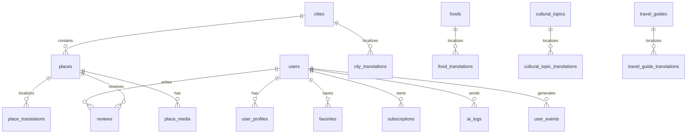

## Core Tables

| Domain | Tables |
|---|---|
| Auth/User | `users`, `user_profiles`, `auth_accounts`, `sessions` |
| Content | `cities`, `places`, `foods`, `cultural_topics`, `festivals`, `historical_events`, `phrases`, `emergency_info`, `travel_guides` |
| Translations | one translation table per content entity |
| Media | `media_assets`, `place_media`, `food_media` |
| Activity | `favorites`, `reviews`, `itineraries`, `itinerary_items`, `search_logs`, `ai_logs`, `user_events` |
| Commerce | `plans`, `subscriptions`, `payments`, `affiliate_clicks`, `sponsored_listings` |
| Admin | `admin_users`, `roles`, `approval_tasks`, `ai_translation_jobs`, `audit_logs` |

## Localization Indexes

```sql
CREATE INDEX idx_place_translations_locale_slug
  ON place_translations(locale, slug);

CREATE INDEX idx_food_translations_locale_slug
  ON food_translations(locale, slug);

CREATE INDEX idx_places_geo
  ON places USING gist (ll_to_earth(lat, lng));

CREATE INDEX idx_places_tags
  ON places USING gin (tags);

CREATE INDEX idx_places_open_hours
  ON places USING gin (open_hours);
```

## Multilingual Search Tables

```sql
CREATE TABLE search_aliases (
  id UUID PRIMARY KEY,
  entity_type TEXT NOT NULL,
  entity_id UUID NOT NULL,
  locale TEXT NOT NULL,
  alias TEXT NOT NULL,
  alias_type TEXT NOT NULL, -- native, romanized, misspelling, historical, synonym
  weight NUMERIC DEFAULT 1.0,
  created_at TIMESTAMPTZ DEFAULT now()
);

CREATE INDEX idx_search_aliases_locale_alias
  ON search_aliases(locale, lower(alias));

CREATE TABLE search_query_logs (
  id UUID PRIMARY KEY,
  user_id UUID,
  anonymous_id TEXT,
  query TEXT NOT NULL,
  detected_language TEXT,
  selected_locale TEXT,
  result_count INT,
  clicked_entity_type TEXT,
  clicked_entity_id UUID,
  created_at TIMESTAMPTZ DEFAULT now()
);
```

OpenSearch document example:

```json
{
  "entity_type": "place",
  "entity_id": "ben_thanh_market",
  "city_id": "ho_chi_minh_city",
  "category": "market",
  "names": {
    "en": "Ben Thanh Market",
    "vi": "Chợ Bến Thành",
    "ko": "벤탄 시장",
    "ja": "ベンタイン市場",
    "zh": "滨城市场",
    "fr": "Marché Ben Thanh"
  },
  "aliases": ["Cho Ben Thanh", "Benthanh", "Ben Tanh Market"],
  "location": { "lat": 10.772, "lon": 106.698 },
  "popularity_score": 0.92
}
```

## Favorites

```sql
CREATE TABLE favorites (
  id UUID PRIMARY KEY,
  user_id UUID REFERENCES users(id),
  entity_type TEXT NOT NULL,
  entity_id UUID NOT NULL,
  created_at TIMESTAMPTZ DEFAULT now(),
  UNIQUE(user_id, entity_type, entity_id)
);
```

## Reviews

```sql
CREATE TABLE reviews (
  id UUID PRIMARY KEY,
  user_id UUID REFERENCES users(id),
  place_id UUID REFERENCES places(id),
  rating INT CHECK (rating BETWEEN 1 AND 5),
  locale TEXT,
  body TEXT,
  status TEXT DEFAULT 'pending',
  created_at TIMESTAMPTZ DEFAULT now()
);
```

## Analytics

```sql
CREATE TABLE user_events (
  id UUID PRIMARY KEY,
  user_id UUID,
  anonymous_id TEXT,
  event_name TEXT NOT NULL,
  locale TEXT,
  detected_language TEXT,
  content_locale TEXT,
  fallback_locale TEXT,
  query_language TEXT,
  ai_response_locale TEXT,
  platform TEXT,
  entity_type TEXT,
  entity_id UUID,
  properties JSONB,
  created_at TIMESTAMPTZ DEFAULT now()
);

CREATE INDEX idx_user_events_name_time ON user_events(event_name, created_at);
CREATE INDEX idx_user_events_props ON user_events USING gin(properties);
```

## Subscription

```sql
CREATE TABLE subscriptions (
  id UUID PRIMARY KEY,
  user_id UUID REFERENCES users(id),
  plan_id UUID REFERENCES plans(id),
  provider TEXT NOT NULL,
  provider_subscription_id TEXT,
  status TEXT NOT NULL,
  started_at TIMESTAMPTZ,
  current_period_end TIMESTAMPTZ,
  canceled_at TIMESTAMPTZ
);
```

---

# 9. Admin Dashboard

## Admin Modules

| Module | Capabilities |
|---|---|
| Content Management | CRUD cities, places, foods, culture, phrases, guides |
| Translation Management | locale status, side-by-side editing, glossary |
| AI Translation Workflow | generate, compare, quality score, regenerate |
| Approval Workflow | draft, review, approved, published, archived |
| User Management | users, roles, bans, support notes |
| Subscription Management | plans, entitlements, refunds, coupons |
| Analytics | traffic, search, AI usage, conversions, content gaps |
| Sponsored Listings | campaigns, placements, disclosures |
| Audit Logs | admin actions and AI job history |

## Content Approval Workflow

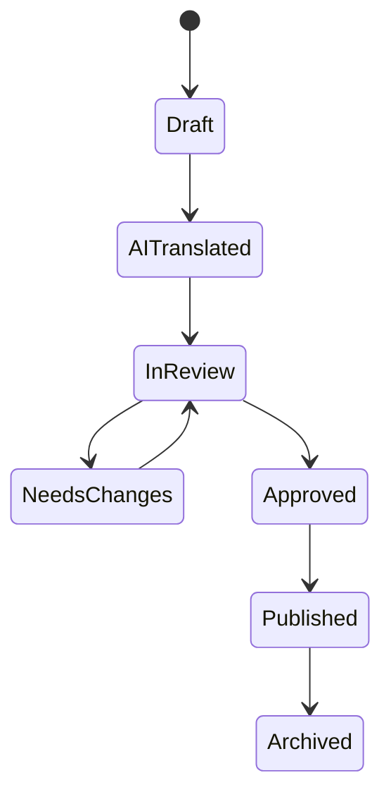

## AI Translation Job

```json
{
  "job_id": "uuid",
  "entity_type": "place",
  "entity_id": "uuid",
  "source_locale": "vi",
  "target_locales": ["en", "ko", "ja", "zh", "fr"],
  "status": "queued",
  "glossary_id": "vietnam_travel_terms_v1",
  "quality_threshold": 0.82
}
```

## Admin UX Screens

| Screen | Key Components |
|---|---|
| Dashboard | KPIs, pending approvals, content gaps |
| Content List | filters by entity, locale, status, city |
| Content Editor | canonical data, translation tabs, SEO tab, AI fields |
| Translation Review | source/target side-by-side, diff, glossary warnings |
| AI Jobs | queue status, retries, cost, logs |
| Analytics | search terms, AI intents, top places, conversion funnel |
| Language Analytics | users, retention, revenue, search, AI usage, translation gaps by language |

## Language Analytics Dashboard

| Widget | Purpose |
|---|---|
| Language funnel | visitor -> signup -> retained -> premium by language |
| Content coverage | published/missing/stale translations per entity and locale |
| Search health | top zero-result queries by detected language |
| AI localization | response locale match rate and fallback rate |
| Revenue | ARPU, affiliate CTR, subscription conversion by language |
| Destinations | top places/cities/foods by language |
| Notifications | delivery/open/conversion by localized template |

---

# 10. SEO Strategy

## URL Structure

```txt
/{locale}
/{locale}/places
/{locale}/places/{slug}
/{locale}/foods
/{locale}/foods/{slug}
/{locale}/culture
/{locale}/culture/{slug}
/{locale}/guides/{slug}
```

Examples:

```txt
/en/places/ben-thanh-market
/ko/places/ben-thanh-market
/ja/places/ben-thanh-market
```

## Metadata Structure

```json
{
  "title": "Ben Thanh Market - Vinago+",
  "description": "Guide to Ben Thanh Market: history, opening hours, tips, food nearby, and directions.",
  "canonical": "https://discovervietnam.app/en/places/ben-thanh-market",
  "alternates": {
    "en": "/en/places/ben-thanh-market",
    "vi": "/vi/places/cho-ben-thanh",
    "ko": "/ko/places/ben-thanh-market",
    "ja": "/ja/places/ben-thanh-market",
    "zh": "/zh/places/ben-thanh-market",
    "fr": "/fr/places/marche-ben-thanh"
  }
}
```

## Hreflang Strategy

Every localized page must render alternates for all published locale versions plus `x-default`.

```html
<link rel="alternate" hreflang="en" href="https://discovervietnam.app/en/places/ben-thanh-market" />
<link rel="alternate" hreflang="vi" href="https://discovervietnam.app/vi/places/cho-ben-thanh" />
<link rel="alternate" hreflang="ko" href="https://discovervietnam.app/ko/places/ben-thanh-market" />
<link rel="alternate" hreflang="ja" href="https://discovervietnam.app/ja/places/ben-thanh-market" />
<link rel="alternate" hreflang="zh-Hans" href="https://discovervietnam.app/zh/places/ben-thanh-market" />
<link rel="alternate" hreflang="fr" href="https://discovervietnam.app/fr/places/marche-ben-thanh" />
<link rel="alternate" hreflang="x-default" href="https://discovervietnam.app/en/places/ben-thanh-market" />
```

Canonical rules:

- Each locale page self-canonicalizes.
- Missing locale pages should not canonicalize to English if the content is not actually localized; they should either show an English fallback with `noindex` or redirect to English by product policy.
- Entity ID, not slug, is the source of truth for alternate mappings.

## Schema.org

Use:

- `TouristAttraction`
- `Restaurant`
- `LandmarksOrHistoricalBuildings`
- `FAQPage`
- `BreadcrumbList`
- `ItemList`
- `Place`

Example:

```json
{
  "@context": "https://schema.org",
  "@type": "TouristAttraction",
  "name": "Ben Thanh Market",
  "address": {
    "@type": "PostalAddress",
    "addressLocality": "Ho Chi Minh City",
    "addressCountry": "VN"
  },
  "geo": {
    "@type": "GeoCoordinates",
    "latitude": 10.772,
    "longitude": 106.698
  }
}
```

## Sitemap

Generate:

- `/sitemap.xml`
- `/sitemaps/places-en.xml`
- `/sitemaps/places-ko.xml`
- `/sitemaps/foods-en.xml`
- `/sitemaps/guides-en.xml`

Sitemap workflow:

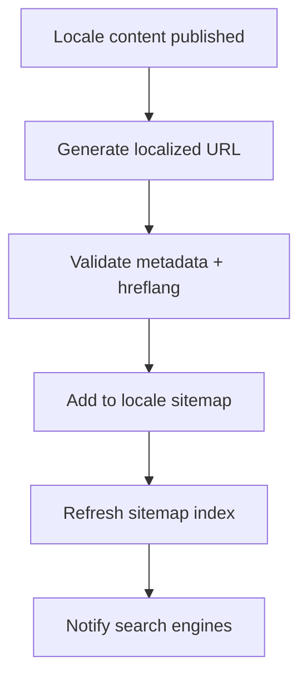

## Internal Linking

Each place page links to:

- city page
- nearby attractions
- nearby foods
- culture tips
- phrasebook category
- AI itinerary landing page

---

# 11. Monetization

## Free Plan

| Feature | Limit |
|---|---|
| Places/Food/Culture | Unlimited |
| AI Chat | 20 messages/day |
| Translation | Text only |
| Favorites | Local + cloud sync basic |
| Itinerary | Basic templates |
| Camera | Preview/limited scans |

## Premium Plan

| Feature | Premium |
|---|---|
| AI Chat | Unlimited fair use |
| AI Camera | Full recognition + OCR |
| Voice Translation | Conversation mode |
| Offline Packs | City packs |
| AI Itinerary | Advanced route optimization |
| Premium Support | Travel safety pack |

## Affiliate Strategy

| Channel | Placement |
|---|---|
| Tours | place detail, itinerary, city guide |
| Hotels | city pages, nearby hotels |
| eSIM | onboarding, pre-trip web, settings |
| Local Experiences | itinerary and hidden gems |
| Transport | airport/nearby/route flows |

Rules:

- Label affiliate/sponsored content.
- Never let sponsorship override emergency, safety, or relevance-critical ranking.
- Use capped placements and quality score thresholds.

---

# 12. Technical Architecture

## System Architecture

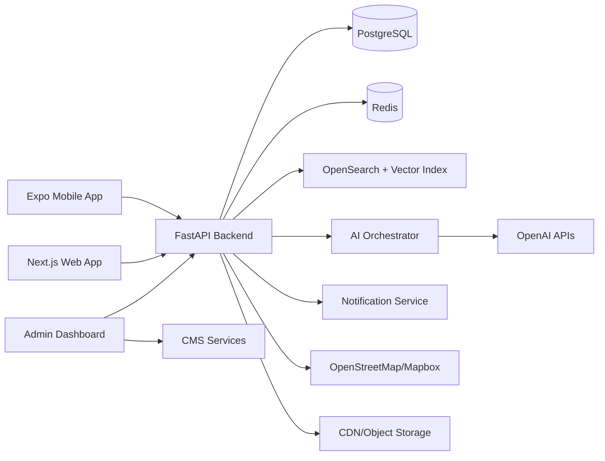

## API Architecture

Base: `/api/v1`

| Endpoint | Method | Purpose |
|---|---|---|
| `/locales` | GET | Supported locales |
| `/content/home` | GET | Home content by locale/city |
| `/places` | GET | List/filter places |
| `/places/{id_or_slug}` | GET | Place detail |
| `/foods` | GET | List foods |
| `/culture-topics` | GET | Culture topics |
| `/phrases` | GET | Phrasebook |
| `/nearby` | GET | Nearby map results |
| `/ai/chat` | POST | AI chat |
| `/ai/itinerary` | POST | Generate itinerary |
| `/ai/camera` | POST | Image analysis |
| `/translation/text` | POST | Text translation |
| `/translation/voice` | POST | Voice translation |
| `/translation/image` | POST | OCR/image translation |
| `/favorites` | GET/POST/DELETE | Favorites |
| `/notifications/preferences` | GET/PUT | Language-aware notification preferences |
| `/subscriptions` | GET/POST | Subscription state |

## API Example

```http
GET /api/v1/places?locale=ko&city=ho-chi-minh-city&category=market
```

```json
{
  "items": [
    {
      "id": "ben_thanh_market",
      "slug": "ben-thanh-market",
      "name": "벤탄 시장",
      "city": "Ho Chi Minh City",
      "category": "Market",
      "summary": "호치민 중심부의 대표적인 전통 시장입니다.",
      "lat": 10.772,
      "lng": 106.698
    }
  ]
}
```

## API Contracts

### Authentication

```http
POST /api/v1/auth/guest
```

```json
{
  "anonymous_id": "device-generated-id",
  "locale": "en",
  "platform": "ios"
}
```

```http
POST /api/v1/auth/oauth
```

```json
{
  "provider": "google",
  "id_token": "oauth-token",
  "locale": "ja"
}
```

### Content Detail

```http
GET /api/v1/places/ben-thanh-market?locale=fr
```

```json
{
  "id": "ben_thanh_market",
  "slug": "ben-thanh-market",
  "locale": "fr",
  "name": "Marche Ben Thanh",
  "description": "Un marche central emblematique...",
  "facts": {
    "city": "Ho Chi Minh City",
    "category": "Market",
    "ticket_price": "Free",
    "open_hours": "7:00 AM - 7:00 PM"
  },
  "actions": ["save", "directions", "ask_ai", "nearby"]
}
```

### Nearby

```http
GET /api/v1/nearby?lat=10.772&lng=106.698&radius=1500&category=cafe&locale=en
```

```json
{
  "center": { "lat": 10.772, "lng": 106.698 },
  "items": [
    {
      "id": "nearby_cafe_1",
      "name": "Local Coffee",
      "category": "coffee",
      "distance_m": 350,
      "rating": 4.5,
      "reason": "A short walk from Ben Thanh Market and good for a quick rest."
    }
  ]
}
```

### AI Chat

```http
POST /api/v1/ai/chat
```

```json
{
  "locale": "en",
  "message": "What should I do near Ben Thanh Market for the next 3 hours?",
  "context": {
    "lat": 10.772,
    "lng": 106.698,
    "city": "Ho Chi Minh City",
    "purpose": "Travel"
  }
}
```

### Admin Translation

```http
POST /api/v1/admin/ai-translations
```

```json
{
  "entity_type": "place",
  "entity_id": "ben_thanh_market",
  "source_locale": "vi",
  "target_locales": ["en", "ko", "ja", "zh", "fr"],
  "fields": ["name", "description", "history", "travel_tip", "seo_title"]
}
```

## Microservice Breakdown

| Service | Responsibility |
|---|---|
| API Gateway | Auth, rate limit, request routing |
| Content Service | localized content retrieval |
| Search Service | full-text, vector, filters |
| AI Orchestrator | intent, retrieval, prompt, tools |
| Map Service | nearby, routes, provider abstraction |
| Translation Service | CMS translations, user translation |
| Notification Service | localized push, email, in-app templates |
| Subscription Service | plans, entitlements, receipts |
| Analytics Service | event ingestion and reporting |
| Admin Service | approvals, roles, audit |

## Notification Service Architecture

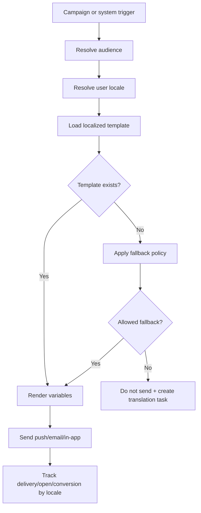

Template table:

```sql
CREATE TABLE notification_templates (
  id UUID PRIMARY KEY,
  template_key TEXT NOT NULL,
  locale TEXT NOT NULL,
  channel TEXT NOT NULL,
  title TEXT,
  body TEXT NOT NULL,
  cta_label TEXT,
  status TEXT DEFAULT 'draft',
  UNIQUE(template_key, locale, channel)
);
```

## AI Service Architecture

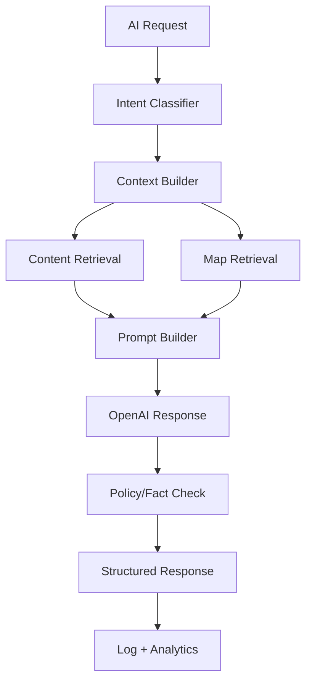

## Caching Strategy

| Cache | TTL | Notes |
|---|---|---|
| Home content | 5 min | keyed by locale/city |
| Place detail | 30 min | invalidate on publish |
| Search results | 5 min | keyed by query/locale |
| Nearby results | 1-5 min | keyed by geohash/category |
| AI retrieval context | 10 min | no personal sensitive data |
| SEO pages | ISR/CDN | invalidate on publish |

## CDN Strategy

- Store images/audio in object storage.
- Serve through CDN with responsive variants.
- Use signed URLs for admin uploads only.
- Public content assets cache long-term with versioned URLs.

## Security Architecture

| Area | Controls |
|---|---|
| Auth | OAuth Google/Apple, email OTP/password, guest mode |
| API | JWT, refresh tokens, rate limiting |
| AI | prompt injection filtering, tool permission gates |
| Privacy | location opt-in, data deletion, minimal retention |
| Payments | provider-managed card handling |
| Admin | RBAC, MFA, audit logs |
| Maps | server-side API key protection where possible |
| Data | encryption at rest, TLS, secrets manager |

---

# 13. MVP Roadmap

## Phase 1 - Foundation MVP

| Item | Detail |
|---|---|
| Timeline | 8-10 weeks |
| Team | 1 PM, 1 UX/UI, 2 full-stack, 1 mobile, 1 content lead, 1 QA part-time |
| Features | multilingual app/web foundation, onboarding, home, explore, place detail, food, culture, phrasebook, favorites, basic AI chat, admin CRUD |
| Budget | USD 80k-140k |
| Risks | content volume, translation QA, scope creep |

## Phase 2 - Maps + AI Depth

| Item | Detail |
|---|---|
| Timeline | 8-12 weeks |
| Team | +1 backend/map engineer, +1 content reviewer |
| Features | nearby map, routes, AI itinerary, richer RAG, analytics, SEO city/place pages |
| Budget | USD 120k-200k |
| Risks | map costs, ranking quality, location privacy |

## Phase 3 - Camera + Voice + Premium

| Item | Detail |
|---|---|
| Timeline | 10-14 weeks |
| Team | +1 AI engineer, +1 mobile engineer |
| Features | AI camera, OCR, voice translation, subscription, offline city packs |
| Budget | USD 160k-260k |
| Risks | AI cost, hallucination, app store review, offline complexity |

## Phase 4 - Scale + Marketplace

| Item | Detail |
|---|---|
| Timeline | 12-20 weeks |
| Team | growth marketer, partnership manager, data analyst |
| Features | affiliates, sponsored listings, local experiences, personalization, review ecosystem |
| Budget | USD 200k-400k |
| Risks | partner quality, ad trust, moderation load |

---

# 14. Development Specifications

## Frontend Stack

| Platform | Stack |
|---|---|
| Mobile | Expo React Native, TypeScript, i18next, expo-localization |
| Web | Next.js App Router, TypeScript, next-intl |
| Admin | Next.js or React Admin, TypeScript |

## Backend Stack

| Layer | Stack |
|---|---|
| API | FastAPI, Pydantic, SQLAlchemy |
| DB | PostgreSQL + PostGIS recommended |
| Cache | Redis |
| Jobs | Celery/RQ/Arq |
| Search | PostgreSQL full-text initially, vector extension/Search service later |
| AI | OpenAI through AI Orchestrator |
| Maps | OpenStreetMap or Mapbox abstraction |

## Mobile i18n Setup

```ts
// app/i18n.ts
import * as Localization from 'expo-localization';
import i18n from 'i18next';
import { initReactI18next } from 'react-i18next';

const supported = ['en', 'vi', 'ko', 'ja', 'zh', 'fr', 'de', 'es', 'ru', 'th'];
const deviceCode = Localization.getLocales()[0]?.languageCode ?? 'en';
const fallbackLng = supported.includes(deviceCode) ? deviceCode : 'en';

i18n.use(initReactI18next).init({
  compatibilityJSON: 'v4',
  lng: fallbackLng,
  fallbackLng: 'en',
  resources: {}
});
```

## Web i18n Setup

```txt
app/[locale]/page.tsx
app/[locale]/places/[slug]/page.tsx
messages/en.json
messages/vi.json
messages/ko.json
messages/ja.json
messages/zh.json
messages/fr.json
messages/de.json
messages/es.json
messages/ru.json
messages/th.json
```

## Multilingual CI Checks

| Check | Rule |
|---|---|
| UI keys | Tier 1 locale files must contain all source keys |
| Hardcoded text | ESLint/custom scan blocks new user-facing hardcoded strings |
| CMS publish | Tier 1 launch-city content cannot publish with missing translations |
| SEO | Published localized pages must have title, description, canonical, hreflang |
| AI | AI endpoint responses must include `response_locale` |
| Search | Search logs must include detected language and selected locale |

## Home Wireframe

```txt
+--------------------------------------------------+
| Search Vietnam, food, phrases...                 |
|--------------------------------------------------|
| Today in Ho Chi Minh City                         |
| [Plan my day with AI]                             |
|--------------------------------------------------|
| AI Ask Box                                        |
| [2 days in Da Nang] [Is banh mi spicy?]           |
| [Traffic tips] [Tell me about this place]         |
|--------------------------------------------------|
| Nearby Suggestions                                |
| [Place card] [Cafe card] [Market card]            |
|--------------------------------------------------|
| Food to Try              Culture Tip              |
+--------------------------------------------------+
```

## Place Detail Wireframe

```txt
+--------------------------------------------------+
| Hero image                                        |
| Name, city, category, rating                      |
| [Save] [Directions] [Ask AI] [Translate]          |
|--------------------------------------------------|
| Why go                                            |
| History                                           |
| Best time | Ticket | Open hours | Safety          |
| Nearby food/cafes                                 |
| Quick AI questions                                |
| Reviews                                           |
+--------------------------------------------------+
```

## AI Chat Wireframe

```txt
+--------------------------------------------------+
| AI Travel Guide                                   |
| Context: Ho Chi Minh City | English | Travel      |
|--------------------------------------------------|
| Assistant: What would you like to know?           |
| User: What should I do near Ben Thanh Market?     |
| Assistant: Here are 4 nearby suggestions...       |
| [Directions] [Save route] [Translate phrase]      |
|--------------------------------------------------|
| [Attach] [Use location] Type message... [Send]    |
+--------------------------------------------------+
```

## Nearby Map Wireframe

```txt
+--------------------------------------------------+
| [Search this area]                                |
| [Attractions] [Food] [Coffee] [Hospital] [ATM]    |
|--------------------------------------------------|
|                                                  |
|                 Interactive Map                  |
|            markers + user location               |
|                                                  |
|--------------------------------------------------|
| Bottom Sheet                                      |
| Ben Thanh Market area                             |
| 1. Cafe 350m - good rest stop                     |
| 2. Museum 900m - fits culture route               |
| [AI route] [Walking] [Driving]                    |
+--------------------------------------------------+
```

## Admin Translation Wireframe

```txt
+--------------------------------------------------+
| Place: Ben Thanh Market            Status: Review |
|--------------------------------------------------|
| Source VI                  Target KO              |
| [Vietnamese content]       [Korean translation]   |
|--------------------------------------------------|
| AI Quality: 86%  Glossary warnings: 1             |
| [Regenerate] [Edit] [Approve] [Request changes]   |
|--------------------------------------------------|
| SEO fields | AI context | Publish checklist        |
+--------------------------------------------------+
```

## Immediate Build Backlog

| Epic | Tickets |
|---|---|
| Multilingual foundation | Tier 1 locale files, detection, switcher, content API locale parameter, CI key checks |
| Content model | cities, places, foods, culture, phrases schemas, translation statuses, aliases, seed data |
| Multilingual search | OpenSearch index, analyzers, aliases, language detection, zero-result analytics |
| Web SEO | locale routes, metadata, hreflang, sitemap, schema.org |
| Mobile MVP | onboarding, tabs, explore, food, culture, phrases, AI, favorites |
| Admin MVP | content CRUD, translations, approval status, locale coverage dashboard |
| AI MVP | chat endpoint, retrieval from content, response locale enforcement, structured response |
| Maps MVP | nearby endpoint, provider abstraction, map UI |
| Notifications MVP | localized template model, push/email preference API |
| Analytics | event schema, key funnels, language dashboards |

## Definition Of Done

- All screens support Tier 1 locales and use English fallback for approved Tier 2 rollout.
- Every content page has localized slug, metadata, and fallback behavior.
- Admin can create content and manage translation approval.
- AI answers include source references, `response_locale`, and uncertainty labels.
- Search supports exact localized names, aliases, romanization, and accent-insensitive matching.
- Notifications use localized templates with fallback policy.
- Analytics dashboards segment users, revenue, retention, search, and AI usage by language.
- Location permission is optional and app remains usable without GPS.
- Sponsored content is labeled and excluded from emergency flows.
- Production web pages pass basic SEO metadata validation.
- Mobile app passes iOS/Android smoke tests in Expo builds.
